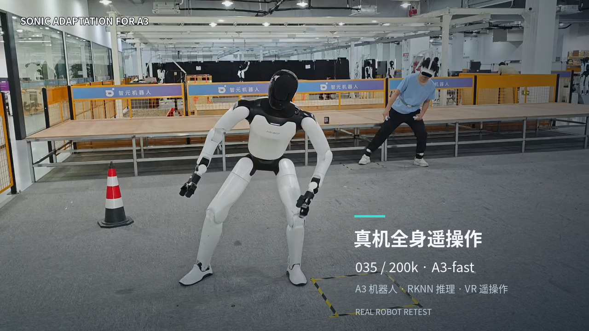

# SONIC adaption for A3

**035 / 200k · A3-fast RKNN · Real-robot teleoperation** — [Watch the video (3:32)](https://agibottech.github.io/sonic_for_a3/).

[Explore the 024 / 035 training curves](https://agibottech.github.io/sonic_for_a3/training/) — searchable, interactive TensorBoard scalar snapshots.

> **Note — Real-robot safety:** We strongly recommend using a safety gantry / fall-arrest harness and appropriate protective measures during real-robot teleoperation. This checkpoint does **not** guarantee stable tracking of every motion; unexpected behavior, loss of balance, and falls can occur. **Before playing any motion or deploying your own teleoperation integration on the real robot, first validate it in MuJoCo.** MuJoCo simulation cannot fully represent real-robot behavior, and successful simulation does not guarantee safe hardware execution. Keep physical safety protection in place, maintain a safe distance from the robot, and prioritize the personal safety of operators and bystanders.

This project builds on
[GR00T-WholeBodyControl / SONIC](https://nvlabs.github.io/GR00T-WholeBodyControl/).
We sincerely thank the GEAR team for their amazing and solid work, their
comprehensive open-source release, and their thorough documentation, which
made this A3 adaptation possible.

This repository is a focused public release of the SONIC whole-body-control
workflow for **AgiBot A3**.  It is intentionally scoped to the 035 training contract, its A3 simulation assets, MuJoCo sim2sim,
and the matching step-200,000 deploy artifacts.

Start with the [end-to-end guide](docs/a3_training2sim2deploy.md). It provides
the authoritative path from A3 flat CSV data to training, sim2sim, ONNX/RKNN,
and a staged deploy package.

The identifier `035` is an experiment label only; it has no special meaning
and does not denote a product version, model generation, or hardware variant.

## What is included

### 1. A3 training code adaptation

The release contains the complete A3 adaptation of the SONIC training workflow:
Hydra configurations, portable launchers, passive-foot URDF/MJCF assets,
selected flat CSV examples, the 035 checkpoint/config location, and the
A3-specific reward and observation contracts. It provides download commands for the pretrained
035 step-200,000 checkpoint trained on the internal motion dataset, targeting
basic walking and simple manipulation abilities; the PT is hosted on
[Hugging Face](https://huggingface.co/sonic-for-a3/sonic/tree/main/035_step200000).

Although this checkpoint was trained using the A3 URDF, its domain randomization
was specifically tuned to support both **A3 and A3 Ultra (A3U)**. The corresponding
models can therefore also run on A3 Ultra.

### 2. MuJoCo sim2sim

It includes MuJoCo sim2sim support with the closed-loop ankle/waist serial and
parallel joint solver, so the same policy interface can be exercised offline
against the A3 model before deployment.

### 3. High-performance C++ deployment on A3

The C++ deployment framework is designed for high-performance inference on A3.
It supports cross-compilation for the A3 RK3588S Rockchip board, including NPU
inference through RKNN, and a Drive Thor target for A3 Ultra through the Thor
runtime variant. **The Rockchip / RKNN deployment workflow also supports A3 Ultra
(A3U)**; A3 Ultra can use either the Rockchip deployment path or the Thor runtime
variant, depending on the target hardware.

Download the step-200,000 G1 and A3-fast ONNX/RKNN artifacts from Hugging Face
before inference or deployment; the runtime configuration already points to
their default local paths.

### 4. Sim-to-real experience and implementation

The release documents and implements the sim-to-real constraints used for A3:
T–N motor curves, serial/parallel joint torque-space limits, and passive-joint
foot simulation. The passive-foot model approximates sole compliance and helps suppress
tiptoe behavior, but still differs substantially from real sole deformation.
Its passive joints can introduce simulation instability and excessive bending;
use them cautiously when training your own policies.

## Current limitations

- The current 035 checkpoint provides only the **G1 encoder** and the
  **A3-fast encoder**. It does not provide an SMPL encoder or a teleoperation
  encoder.
- A3-fast is the low-latency deployment path: it uses the G1 encoder with a
  20 ms frame interval and exposes future frames through 180 ms. It is not a
  separate SMPL or teleoperation representation, so an upstream real-time
  retargeting module is still required. This release cannot directly run the
  original SONIC SMPL teleoperation chain or the `MotionBricks + VR3 point`
  hybrid chain.
- Wrist tracking ability remains poor because of the current training data
  distribution. The 035 checkpoint is not the final wrist-tracking
  quality target.
- The current policy is intended for motions whose ground contact stays on both
  feet or in which one foot is lifted from the ground. It does not currently
  support kneeling, lying down, standing back up, or other motions that add
  contact between the ground and additional limbs.
- Fast running and other highly dynamic motions are outside the current
  capability and validation scope.

## Future TODO

- [ ] Publish a better wrist-tracking checkpoint.
- [ ] Publish a checkpoint with SMPL and teleoperation encoders.
- [ ] Provide a complete open-source teleoperation pipeline.
- [ ] Improve sim-to-real transfer and expand abilities, including ground-based motions.
- [ ] Add a detailed deployment-on-Thor tutorial for the A3 Ultra Thor runtime.

## Licensing and asset provenance

Source code and the released **035 step-200,000 model artifacts (PT, ONNX and
RKNN)** are licensed under the [Apache License 2.0](LICENSE). Third-party
components and data retain their respective licenses and notices; see
[Third-party and asset notices](docs/THIRD_PARTY_NOTICES.md).  The A3 robot description is a modified derivative of the
public [AgibotTech/A3-A3U-robot-model](https://github.com/AgibotTech/A3-A3U-robot-model)
and is subject to its [Mulan Permissive Software License v2](https://github.com/AgibotTech/A3-A3U-robot-model/blob/main/LICENSE.txt)
and retained notices.

Real robots can cause injury or damage.  Treat the deploy package as a
development reference: first run receive-only and simulator checks, verify
joint mapping and safety limits for the target robot, and use an operator-
controlled staged bring-up. The authoritative MDU service takeover, no-command
probe, and `taskset -c 4-5` launch sequence is §6.1 of the
[end-to-end guide](docs/a3_training2sim2deploy.md).
