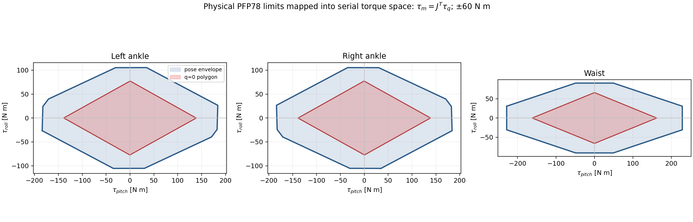

# 01 — Serial/Parallel Torque Coupling

This topic documents the pose-dependent map between the policy's serial ankle/waist pitch-roll coordinates and the two physical motor shafts. The runtime convention is

$$
\dot{\boldsymbol q}_{\mathrm{joint}} = J(\boldsymbol q)\,\dot{\boldsymbol q}_{\mathrm{motor}},\qquad
\boldsymbol\tau_{\mathrm{motor}} = J(\boldsymbol q)^{\mathsf T}\,\boldsymbol\tau_{\mathrm{joint}}
$$

## Subject overview

The controller asks for a serial pitch/roll torque, while the ankle or waist is physically driven by two motors. The Jacobian changes with pose, so the same serial request can consume different motor torque headroom.



The feasible serial torque set is therefore a pose-dependent polygon. Applying independent rectangular limits directly to serial pitch and roll is not equivalent. `reachable`, `det`, `err`, and `near_singular` in the tables record whether each sampled pose is usable for the inverse map.

## File map

| Path | Type | What it contains / how it is used |
| --- | --- | --- |
| [`jacobian_tables/left_ankle_jacobi.csv`](jacobian_tables/left_ankle_jacobi.csv) | **raw tabular grid** | Human-readable left-ankle pitch/roll grid with `J00..J11`, motor offsets/scale terms, determinant, round-trip error, and reachability flags. |
| [`jacobian_tables/right_ankle_jacobi.csv`](jacobian_tables/right_ankle_jacobi.csv) | **raw tabular grid** | Same schema for the right ankle. |
| [`jacobian_tables/waist_jacobi.csv`](jacobian_tables/waist_jacobi.csv) | **raw tabular grid** | Same schema for the waist pitch/roll pair. |
| [`runtime_tables/`](runtime_tables/) | **runtime-format derived tables** | Compressed NPZ copies consumed by the packaged actuator/reward path; arrays are `pitch_axis`, `roll_axis`, `J`, `m`, `det`, `err`, `reachable`, and `near_singular`. |
| [`figures/jacobian_diagnostics/`](figures/jacobian_diagnostics/) | **diagnostic source assets** | NPZ diagnostic tables retained with the figure evidence. They are not a replacement for the CSV source grids. |
| [`figures/a3_serial_joint_torque_space.png`](figures/a3_serial_joint_torque_space.png) | **derived figure** | PFP78 ±60 Nm physical motor limits mapped into serial torque space; red is the near-zero polygon and blue is the sampled pose envelope. |
| [`armature_reference.csv`](armature_reference.csv) | **reference table** | Historical speed-matching armature values for the parallel output coordinates. These are reference parameters, not a full closed-chain inertia identification. |
| [`solver/a3_loop/include/`](solver/a3_loop/include/) | **interface snapshot** | Public solver headers used by the ankle/waist mapping integration. |
| [`solver/a3_loop/lib/liba3_ankle_waist_solver.a`](solver/a3_loop/lib/liba3_ankle_waist_solver.a) | **built binary** | Solver library packaged with this material set; rebuild provenance is outside this archive. |
| [`code_snapshot/a3.py`](code_snapshot/a3.py) | **code snapshot** | Training-side A3 actuator configuration at packaging time. |
| [`code_snapshot/sim2sim_a3_mujoco.py`](code_snapshot/sim2sim_a3_mujoco.py) | **code snapshot** | Standalone MuJoCo mapping and playback integration at packaging time. |
| [`validation/test_a3_motor_model.py`](validation/test_a3_motor_model.py) | **validation** | Checks the table schema, Jacobian round-trip behavior, reachability and motor-space mapping. |

## Source and runtime locations

The authoritative Python implementations are `gear_sonic/envs/manager_env/robots/a3.py`, `gear_sonic/envs/manager_env/mdp/rewards.py`, and `gear_sonic/scripts/sim2sim_a3_mujoco.py`. The CSV grids are the review source; NPZ files are the runtime-compatible serialization. Do not edit a snapshot and assume the runtime changed.

To regenerate NPZ tables without overwriting this package:

```bash
python docs/a3_024_sim2real_materials/tools/build_jacobi_tables.py \
  --input-dir docs/a3_024_sim2real_materials/01_serial_parallel_torque_coupling/jacobian_tables \
  --output-dir /tmp/a3_jacobian_tables --plots
```

The torque-space figure is generated by `gear_sonic/scripts/build_a3_motor_space_figures.py`; copy reviewed outputs into this topic's `figures/` directory only after checking them.
