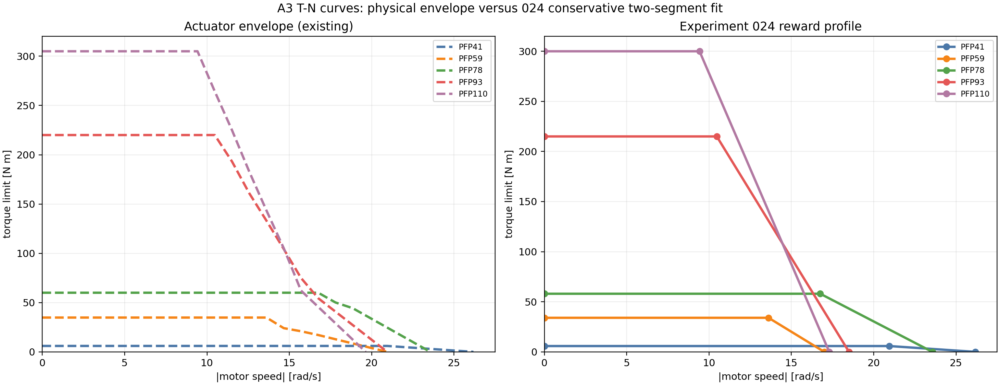

# 02 — A3 Torque–Speed Limits and Reward

This topic is the motor capability and reward contract used by the A3 training workflow. Speed is the absolute physical motor output-shaft speed in rad/s. Torque is the symmetric motor limit in Nm. Each family uses a constant-torque plateau followed by a linear drop to zero; the reward profile is separate from the simulator actuator envelope.

## Subject overview

The motor reward checks the policy demand against each motor family's physical torque-speed envelope. The left panel shows the existing actuator envelope; the right panel shows the conservative two-segment reward fit used for training and evaluation.

## File map

| Path | Type | What it contains / how it is used |
| --- | --- | --- |
| [`reward_024_tn_curves.csv`](reward_024_tn_curves.csv) | **raw/reference table** | Active two-segment reward fit: plateau torque, plateau end speed, and zero-torque speed for PFP41/59/78/93/110. |
| [`config/sonic_a3_024.yaml`](config/sonic_a3_024.yaml) | **experiment config snapshot** | Reference training configuration that selects the motor reward and related constraint terms. |
| [`code_snapshot/a3_motor_model.py`](code_snapshot/a3_motor_model.py) | **code snapshot** | Motor model and T-N profile implementation as packaged for review. |
| [`code_snapshot/rewards.py`](code_snapshot/rewards.py) | **code snapshot** | Reward-side utilization, speed, power, and ankle constraint terms as packaged for review. |
| [`figures/a3_024_torque_speed_reward.png`](figures/a3_024_torque_speed_reward.png) | **derived figure** | Existing actuator envelope compared with the conservative reward fit. |
| [`validation/test_a3_motor_reward.py`](validation/test_a3_motor_reward.py) | **validation** | Checks interpolation, limits, utilization penalty and constraint behavior. |

## Active values

| Motor | Plateau (Nm) | Plateau end (rad/s) | Zero torque (rad/s) |
| --- | ---: | ---: | ---: |
| PFP41 | 5.8 | 20.943951 | 26.179939 |
| PFP59 | 34.0 | 13.613568 | 17.000000 |
| PFP78 | 58.0 | 16.755161 | 23.561945 |
| PFP93 | 215.0 | 10.471976 | 18.500000 |
| PFP110 | 300.0 | 9.424778 | 17.300000 |

The motor utilization and the main T–N penalty are rendered as equations below. Utilization is capped at 2.0. For parallel ankles and waist, serial demand is mapped through the Jacobian before motor utilization is evaluated. Speed, positive-power, and fixed-torque ankle constraints remain separate terms.

$$
r = \frac{|\tau_{\mathrm{motor}}|}{\tau_{\mathrm{limit}}(|\omega_{\mathrm{motor}}|)},\qquad 0 \le r \le 2
$$

$$
\mathcal{L}_{\mathrm{TN}} = 0.05\,\min(r,1)^8 + 5\,\max(r-1,0)^2
$$

## Authority

The authoritative runtime code is `gear_sonic/utils/a3_motor_model.py` and `gear_sonic/envs/manager_env/mdp/rewards.py`; the files under `code_snapshot/` are frozen review copies. This material describes a training/evaluation penalty and actuator model. It is not a real-robot current, temperature, or safety controller.
