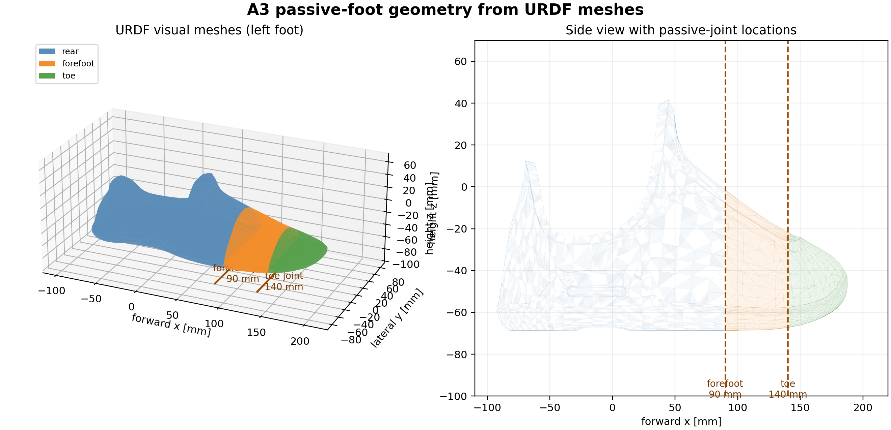

# 03 — Two-Stage Passive Foot

This topic records the passive-foot measurement inputs, fit outputs, and robot assets used by the A3 simulation path. Each foot adds two physics-only joints (forefoot and toe); they are not part of the 29-dimensional policy action.

## Subject overview

The passive-foot model adds a forefoot joint at 90 mm and a toe joint at 140 mm. These joints absorb contact and toe-loading motion in the physics model; the policy still outputs the original 29 action dimensions. The URDF visual-mesh rendering below shows the packaged rear, forefoot, and toe geometry; the dashed lines mark the two passive-joint locations. It connects the fitted model to the compression-bench measurements in `raw/`.

## File map

| Path | Type | What it contains / how it is used |
| --- | --- | --- |
| [`raw/`](raw/) | **raw bench data** | Five byte-preserved GB18030 CSV exports from the A3 metal-shoe toe-cantilever compression test. See [`raw/README.md`](raw/README.md) for source labels, columns, encoding and limits of interpretation. |
| [`raw/raw_manifest.csv`](raw/raw_manifest.csv) | **integrity manifest** | File sizes and SHA-256 values for each raw CSV. |
| [`fit_params.txt`](fit_params.txt) | **fit output** | Fitted two-stage stiffness/geometry parameters used to build the passive-foot assets. |
| [`fit_rmse.csv`](fit_rmse.csv) | **fit validation output** | Per-curve fit residual summary. |
| [`robot_asset/urdf_a3/model_collision_optimized_passive_foot_twostage_fit_optimized.urdf`](robot_asset/urdf_a3/model_collision_optimized_passive_foot_twostage_fit_optimized.urdf) | **Isaac/PhysX asset** | Fitted passive-foot URDF with optimized collision geometry. |
| [`robot_asset/mjcf/a3_t2d5_loop_passive_foot_twostage_fit_optimized.xml`](robot_asset/mjcf/a3_t2d5_loop_passive_foot_twostage_fit_optimized.xml) | **MuJoCo asset** | Matching fitted passive-foot model for the loop/sim2sim path. |
| `robot_asset/urdf_a3/meshes/` | **visual meshes** | Robot visual geometry packaged with the URDF. |
| `robot_asset/urdf_a3/meshes_collision_optimized/` | **collision meshes** | Optimized collision geometry referenced by the URDF. |
| [`code_snapshot/a3_robot_config.py`](code_snapshot/a3_robot_config.py) | **code snapshot** | Training-side passive-foot, armature, effort and PD settings at packaging time. |
| [`code_snapshot/build_a3_passive_foot_assets.py`](code_snapshot/build_a3_passive_foot_assets.py) | **build snapshot** | Asset generation logic and fit constants at packaging time. |
| `validation/` | **validation** | No standalone validation directory is included in this archive; use the repository passive-foot checks when available. |

## Fitted model values

| Joint | Reference point | Position range | Fitted stiffness |
| --- | ---: | ---: | ---: |
| forefoot | 90 mm | ±0.06606093 rad | 2396.666 Nm/rad |
| toe | 140 mm | ±0.2305825 rad | 27.58407 Nm/rad |

The URDF damping values are 1.51683722 and 0.0686125693 Nm·s/rad for forefoot and toe. The MJCF and URDF are released derived assets; they do not replace the raw bench curves or fit outputs.

## Interpretation boundary

The bench curves are quasi-static measurements. They do not identify dynamic damping, contact timing, complete fixture calibration, or a causal sim2real gain. The `raw/README.md` source labels must be retained when reusing the data.
